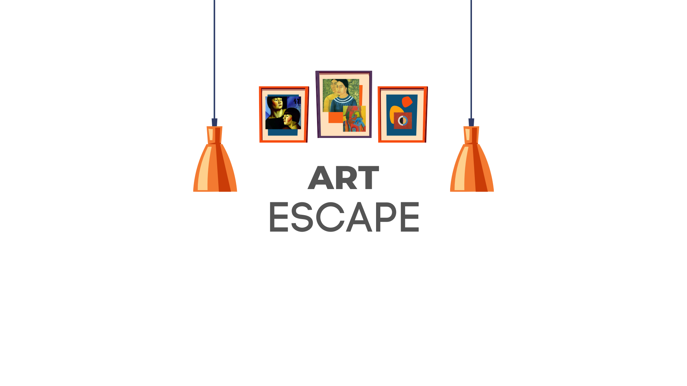

# ArtEscape

**_ArtEscape_** is a Full Stack web application built in collaboration with an international team and designed to inspire and educate art enthusiasts of all levels.
It offers a unique blend of interactive gameplay and immersive art lessons.

## Technologies

The main technologies used to develop this project were:

- NodeJs and Express for the backend.
- ReactJs, Javascript ES6, HTML and Css for the frontend.

## User Flow

The initial design with Figma.

## Database schema

## Setup

### Dependencies

- Run `npm install` in project directory. This will install server-related dependencies such as `express`.
- `cd client` and run `npm install`. This will install client dependencies (React).
- Run `npm run migrate` in the project folder of this repository, in a new terminal window. This will create the Database `artescape` and the tables in your local machine.
- `cd client` and run `npm run dev`. Follow the link provided.

## Notes and Sources

[Artist detailed info](http://www.wikiart.org/en/{seo_name}?json=2)  
[Emma Amos biography](https://emmaamos.com/about/bio/)

[Paintings by artist](http://www.wikiart.org/en/App/Painting/PaintingsByArtist?artistUrl=fernand-leger&json=2)

_This is a student project that was created at [CodeOp](http://codeop.tech), a full stack development bootcamp in Barcelona._
